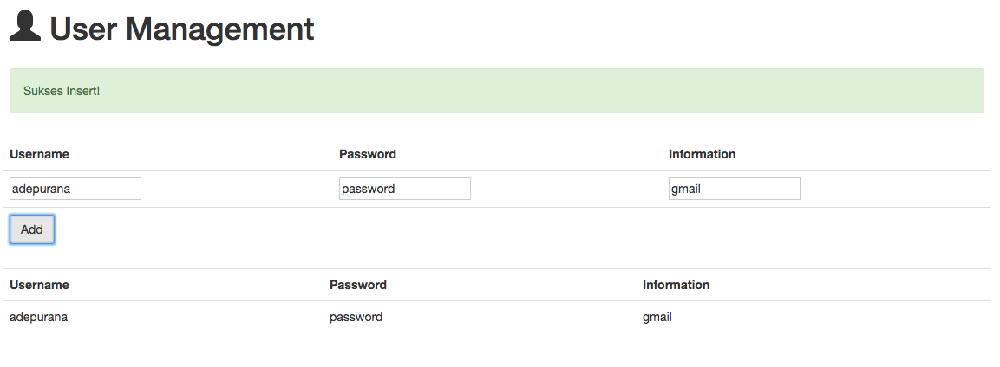
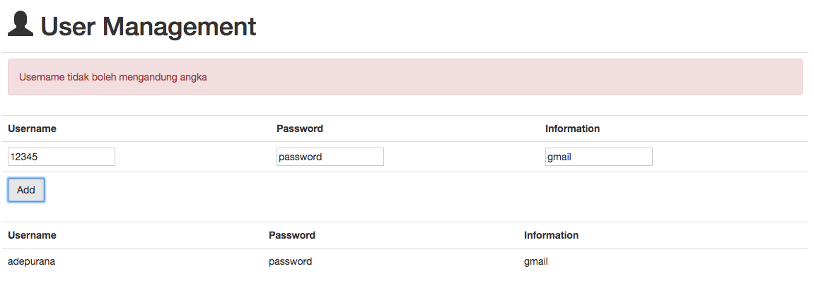

# :fire: 007 Web API Express RESTful CRUD :fire:

## Description
This repository is built to fulfill the task from Hacktiv 8 coding bootcamp in phase 2.

By using this application, you can add any username , password, and any additional description of your account.

This project is build using
- **Bootstrap**
- **Express**
- **Sequelize**
- **Postgrees**
- **Ajax**
- **jQuery**

### How to install
```shell
npm install
sequelize db:migrate
npm start
```
### Capture



